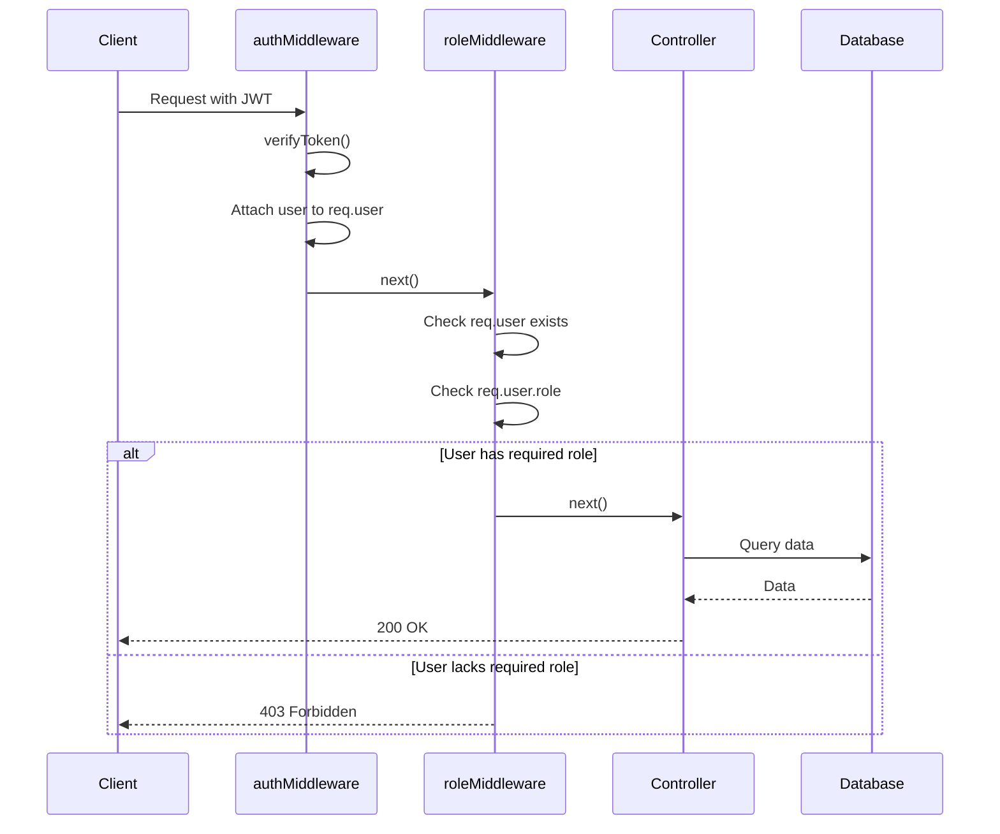

## Overview

The E-commerce API implements **Role-Based Access Control (RBAC)** to restrict access to resources based on user roles. The system supports two roles: `customer` and `admin`, each with different permission levels.

## Roles

### Customer

Regular users with access to shopping features:

**Permissions:**
- Browse products and categories (public)
- Manage personal shopping cart
- Place and view own orders
- Update own profile

**Default Role:** All new registrations are assigned the `customer` role by default.

### Admin

Administrative users with full system access:

**Permissions:**
- All customer permissions
- Create, update, and delete products
- Manage categories
- View all orders
- Update order status
- Create users with specific roles
- Delete users

<Warning>
  Admin accounts must be created through the `createUserWithRole` endpoint by an existing admin. Regular registration always creates customer accounts.
</Warning>

## Role Middleware

The `roleMiddleware` function validates user roles before allowing access to protected routes.

### Implementation

```typescript
export function roleMiddleware(...allowedRoles: Role[]) {
  return (req: Request, res: Response, next: NextFunction) => {
    // Verify user is authenticated (must pass through authMiddleware first)
    if (!req.user) {
      return res.status(401).json({ error: "Unauthorized - No user found" });
    }

    // Verify user has a role assigned
    if (!req.user.role) {
      return res.status(403).json({ error: "Forbidden - No role assigned" });
    }

    // Verify user's role is in the allowed roles
    if (!allowedRoles.includes(req.user.role)) {
      return res.status(403).json({
        error: `Forbidden - Requires one of the following roles: ${allowedRoles.join(', ')}`
      });
    }

    // User authorized, continue
    next();
  };
}
```

**Source:** `backend/src/middleware/role.middleware.ts:10`

**Process:**
1. Check if `req.user` exists (set by `authMiddleware`)
2. Verify user has a role assigned
3. Check if user's role is in the allowed roles list
4. Return 403 Forbidden if unauthorized, otherwise continue

### Predefined Middleware

```typescript
// Middleware specific for admins
export const adminOnly = roleMiddleware("admin");

// Middleware for admins and customers (authenticated users)
export const authenticatedUser = roleMiddleware("admin", "customer");
```

**Source:** `backend/src/middleware/role.middleware.ts:37`

## Authorization Flow



## Route Protection Examples

### Admin-Only Routes

Product management requires admin privileges:

```typescript
import { authMiddleware } from "../middleware/auth.middleware.js";
import { adminOnly } from "../middleware/role.middleware.js";

const router = Router();
const controller = new ProductController();

// Public routes (no authentication required)
router.get("/", controller.getAll);
router.get("/:id", controller.getById);

// Protected routes (admin only)
router.post("/", 
  authMiddleware,     // Verify JWT
  adminOnly,          // Verify admin role
  validateDto(CreateProductDto), 
  controller.create
);

router.put("/:id", 
  authMiddleware, 
  adminOnly, 
  validateDto(UpdateProductDto), 
  controller.update
);

router.delete("/:id", 
  authMiddleware, 
  adminOnly, 
  controller.delete
);
```

**Source:** `backend/src/routes/product.routes.ts`

<Info>
  Middleware order matters: `authMiddleware` must run before `roleMiddleware` to populate `req.user`.
</Info>

### Authenticated User Routes

Cart operations require authentication but work for all logged-in users:

```typescript
import { authMiddleware } from "../middleware/auth.middleware.js";

const router = Router();
const controller = new CartController();

// All routes require authentication
router.use(authMiddleware);

router.get("/", controller.getCart);
router.post("/add", validateDto(AddToCartDto), controller.addToCart);
router.put("/item/:id", validateDto(UpdateCartItemDto), controller.updateItem);
router.delete("/item/:id", controller.removeItem);
router.delete("/clear", controller.clearCart);
```

**Source:** `backend/src/routes/cart.routes.ts`

<Note>
  Using `router.use(authMiddleware)` applies authentication to all routes defined below it.
</Note>

### Custom Role Combinations

You can create middleware for specific role combinations:

```typescript
// Allow both admins and customers (any authenticated user)
const authenticatedUser = roleMiddleware("admin", "customer");

// Admin-only
const adminOnly = roleMiddleware("admin");

// Customer-only (hypothetical)
const customerOnly = roleMiddleware("customer");
```

## Access Control Matrix

| Resource | Action | Public | Customer | Admin |
|----------|--------|--------|----------|-------|
| **Products** | List all | ✅ | ✅ | ✅ |
| | View details | ✅ | ✅ | ✅ |
| | Create | ❌ | ❌ | ✅ |
| | Update | ❌ | ❌ | ✅ |
| | Delete | ❌ | ❌ | ✅ |
| **Categories** | List all | ✅ | ✅ | ✅ |
| | Create | ❌ | ❌ | ✅ |
| | Update | ❌ | ❌ | ✅ |
| | Delete | ❌ | ❌ | ✅ |
| **Cart** | View own | ❌ | ✅ | ✅ |
| | Add items | ❌ | ✅ | ✅ |
| | Update items | ❌ | ✅ | ✅ |
| | Remove items | ❌ | ✅ | ✅ |
| | Clear cart | ❌ | ✅ | ✅ |
| **Orders** | View own | ❌ | ✅ | ✅ |
| | Create order | ❌ | ✅ | ✅ |
| | View all orders | ❌ | ❌ | ✅ |
| | Update status | ❌ | ❌ | ✅ |
| **Users** | Register | ✅ | ✅ | ✅ |
| | Login | ✅ | ✅ | ✅ |
| | Create with role | ❌ | ❌ | ✅ |
| | Delete user | ❌ | ❌ | ✅ |

## Resource Ownership

Some operations require users to own the resource they're accessing:

### Cart Access

Users can only access their own cart:

```typescript
async getCart(req: Request, res: Response) {
  const userId = req.user!.id; // From JWT token
  const cart = await this.cartService.getOrCreateCart(userId);
  res.json(cart);
}
```

The cart service automatically filters by `userId` from the JWT token, preventing users from accessing other users' carts.

### Order Access

**Customers** can only view their own orders:

```typescript
if (req.user.role === 'customer') {
  const orders = await prisma.order.findMany({
    where: { userId: req.user.id }
  });
}
```

**Admins** can view all orders:

```typescript
if (req.user.role === 'admin') {
  const orders = await prisma.order.findMany();
}
```

<Warning>
  Always validate resource ownership in the service layer, not just in the controller. This prevents privilege escalation attacks.
</Warning>

## Creating Admin Users

Admin accounts must be created through a special endpoint:

```typescript
async createUserWithRole(data: CreateUserWithRoleDto) {
  const existing = await this.userRepo.findByEmail(data.email);
  if (existing) throw new ConflictError("El email ya está en uso");

  const hashed = await bcrypt.hash(data.password, 10);
  const user = await this.userRepo.createUser({
    name: data.name,
    email: data.email,
    passwordHash: hashed,
    role: data.role,
  });

  return user;
}
```

**Source:** `backend/src/services/auth.services.ts:52`

### API Request

```http
POST /auth/users
Authorization: Bearer <admin-jwt-token>
Content-Type: application/json

{
  "name": "Admin User",
  "email": "admin@example.com",
  "password": "secureAdminPass123",
  "role": "admin"
}
```

<Info>
  This endpoint must be protected with `authMiddleware` and `adminOnly` to prevent privilege escalation.
</Info>

## Error Responses

### 401 Unauthorized

Returned when authentication is missing or invalid:

```json
{
  "error": "Unauthorized - No user found"
}
```

**Causes:**
- No JWT token provided
- Invalid or expired JWT token
- Token signature verification failed

### 403 Forbidden

Returned when user lacks required role:

```json
{
  "error": "Forbidden - Requires one of the following roles: admin"
}
```

**Causes:**
- User has a valid token but insufficient permissions
- Attempting to access admin-only resources as a customer
- User has no role assigned (edge case)

## Security Best Practices

<AccordionGroup>
  <Accordion title="Principle of Least Privilege">
    - Grant users the minimum permissions needed
    - Default new users to `customer` role
    - Require explicit admin creation through protected endpoints
    - Regularly audit admin accounts
  </Accordion>

  <Accordion title="Defense in Depth">
    - Validate authorization at multiple layers:
      - Middleware (route-level)
      - Service layer (business logic)
      - Database queries (filter by userId)
    - Never trust client-side role claims
    - Always verify roles from the JWT payload
  </Accordion>

  <Accordion title="Audit Logging">
    - Log all admin actions (create, update, delete)
    - Track failed authorization attempts
    - Monitor for privilege escalation attempts
    - Implement audit trails for sensitive operations
  </Accordion>

  <Accordion title="Role Immutability">
    - Don't allow users to change their own role
    - Require admin privileges to assign roles
    - Consider two-factor authentication for admin accounts
    - Implement role change notifications
  </Accordion>
</AccordionGroup>

## Testing Authorization

### Test Customer Access

```bash
# Login as customer
TOKEN=$(curl -s -X POST http://localhost:3000/auth/login \
  -H "Content-Type: application/json" \
  -d '{"email":"customer@example.com","password":"pass123"}' \
  | jq -r '.token')

# Try to create product (should fail with 403)
curl -X POST http://localhost:3000/products \
  -H "Authorization: Bearer $TOKEN" \
  -H "Content-Type: application/json" \
  -d '{"name":"Laptop","price":999.99,"stock":10}'
```

**Expected Response:**
```json
{
  "error": "Forbidden - Requires one of the following roles: admin"
}
```

### Test Admin Access

```bash
# Login as admin
ADMIN_TOKEN=$(curl -s -X POST http://localhost:3000/auth/login \
  -H "Content-Type: application/json" \
  -d '{"email":"admin@example.com","password":"adminpass123"}' \
  | jq -r '.token')

# Create product (should succeed)
curl -X POST http://localhost:3000/products \
  -H "Authorization: Bearer $ADMIN_TOKEN" \
  -H "Content-Type: application/json" \
  -d '{
    "name": "Laptop",
    "price": 999.99,
    "stock": 10,
    "categoryId": 1,
    "description": "High-performance laptop",
    "imageUrl": "https://example.com/laptop.jpg"
  }'
```

**Expected Response:**
```json
{
  "id": 1,
  "name": "Laptop",
  "price": 999.99,
  "stock": 10,
  "categoryId": 1,
  "description": "High-performance laptop",
  "imageUrl": "https://example.com/laptop.jpg",
  "createdAt": "2026-03-06T10:30:00Z",
  "updatedAt": "2026-03-06T10:30:00Z"
}
```

## Common Authorization Patterns

### Pattern 1: Public with Optional Auth

```typescript
// Apply auth middleware but don't fail if no token
router.get("/products", optionalAuthMiddleware, controller.getAll);

// Controller adjusts response based on user role
if (req.user?.role === 'admin') {
  // Include admin-only fields
} else {
  // Return public fields only
}
```

### Pattern 2: Hierarchical Permissions

```typescript
// Admin inherits all customer permissions
const hasPermission = (userRole: Role, requiredRole: Role) => {
  if (requiredRole === 'customer') return true; // Both roles allowed
  if (requiredRole === 'admin') return userRole === 'admin';
  return false;
};
```

### Pattern 3: Resource-Based Authorization

```typescript
// Check if user owns the resource or is admin
const canAccessOrder = (userId: number, order: Order, userRole: Role) => {
  return userRole === 'admin' || order.userId === userId;
};
```

## Next Steps

<CardGroup cols={2}>
  <Card title="Authentication" icon="lock" href="/concepts/authentication">
    Learn about JWT authentication
  </Card>
  <Card title="API Reference" icon="book" href="/api/overview">
    View all protected endpoints
  </Card>
  <Card title="Middleware" icon="filter" href="/concepts/architecture">
    Understand middleware architecture
  </Card>
  <Card title="Database Schema" icon="database" href="/concepts/database-schema">
    Explore the Role enum and User model
  </Card>
</CardGroup>