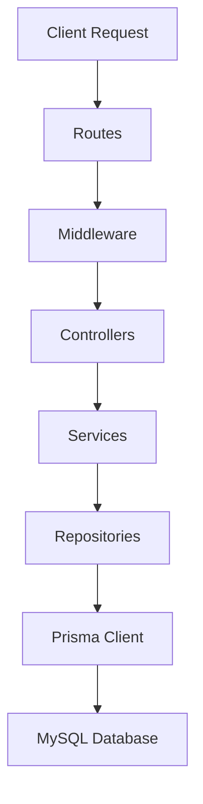

## Overview

The E-commerce API is a production-ready REST API built with Node.js, Express, TypeScript, and Prisma ORM. It provides a complete backend solution for e-commerce applications with robust authentication, product management, shopping cart functionality, and order processing.

<CardGroup cols={2}>
  <Card
    title="Quick Start"
    icon="rocket"
    href="/quickstart"
  >
    Get up and running in minutes with our step-by-step guide
  </Card>
  <Card
    title="API Reference"
    icon="code"
    href="/api/overview"
  >
    Explore all available endpoints and their parameters
  </Card>
  <Card
    title="Installation"
    icon="download"
    href="/installation"
  >
    Complete setup guide for development and production
  </Card>
  <Card
    title="Authentication"
    icon="lock"
    href="/api/authentication"
  >
    Learn about JWT-based authentication and authorization
  </Card>
</CardGroup>

## Key Features

### Authentication & Authorization
- **JWT-based authentication** with secure token generation
- **Role-based access control** (customer/admin roles)
- **Rate limiting** on auth endpoints (10 requests per 15 minutes)
- **Password hashing** with bcrypt
- User registration, login, and profile management

### Product Management
- Full CRUD operations for products
- **Image upload** support with Cloudinary integration
- Product categorization
- Stock tracking and inventory management
- Search and filtering capabilities
- Public read access, admin-only write access

### Shopping Cart
- User-specific cart management
- Add, update, and remove items
- Automatic quantity validation
- Cart persistence across sessions
- Real-time total calculations

### Order Processing
- Create orders from cart contents
- Order history tracking
- Order status management (pending, shipped, delivered, cancelled)
- Price snapshots at purchase time
- User-specific order queries

### Security Features
- **Helmet.js** for HTTP security headers
- **CORS** configuration with credential support
- **Rate limiting** on sensitive endpoints
- **File upload restrictions** (5MB max, safe filenames)
- **Input validation** with class-validator
- **SQL injection protection** via Prisma ORM

## Tech Stack

<CardGroup cols={2}>
  <Card title="Runtime" icon="node">
    Node.js with TypeScript
  </Card>
  <Card title="Framework" icon="server">
    Express.js 5.x
  </Card>
  <Card title="Database" icon="database">
    MySQL 8.4 with Prisma ORM
  </Card>
  <Card title="Authentication" icon="key">
    JWT (jsonwebtoken)
  </Card>
</CardGroup>

## Architecture

The API follows a **layered architecture** pattern:



- **Routes**: Define API endpoints and apply middleware
- **Middleware**: Handle authentication, validation, and error handling
- **Controllers**: Process HTTP requests and responses
- **Services**: Implement business logic
- **Repositories**: Abstract database operations
- **Prisma Client**: Type-safe database queries

## API Structure

The API is organized into the following main modules:

| Module | Base Path | Description |
|--------|-----------|-------------|
| Authentication | `/auth` | User registration, login, profile management |
| Products | `/products` | Product catalog management |
| Categories | `/categories` | Product category organization |
| Cart | `/cart` | Shopping cart operations |
| Orders | `/orders` | Order creation and history |

## Data Models

The API uses the following core data models:

### User
- `id`: Integer (auto-increment)
- `name`: String
- `email`: String (unique)
- `passwordHash`: String (bcrypt hashed)
- `role`: Enum (customer, admin)
- Relations: cart, orders

### Product
- `id`: Integer (auto-increment)
- `name`: String (indexed)
- `description`: String (optional)
- `price`: Decimal (10,2)
- `imageUrl`: String
- `stock`: Integer
- `categoryId`: Integer (optional)
- Relations: category, cartItems, orderItems

### Cart & CartItem
- One-to-one relationship with User
- CartItems track product quantity in cart
- Automatic cascade deletion

### Order & OrderItem
- Order status tracking (pending, shipped, delivered, cancelled)
- OrderItems capture price at purchase time
- Indexed by userId and status

## Response Format

All API responses follow consistent patterns:

**Success Response:**
```json
{
  "message": "Operation successful",
  "data": { ... }
}
```

**Error Response:**
```json
{
  "error": "Error message",
  "details": [ ... ]
}
```

<Note>
  All timestamps are in ISO 8601 format (UTC timezone)
</Note>

## Rate Limits

<Warning>
  Authentication endpoints (`/auth/register`, `/auth/login`) are rate-limited to **10 requests per 15 minutes** per IP address.
</Warning>

Other endpoints currently have no rate limits but may be added in future versions.

## Getting Help

If you need assistance:

1. Check the [Quick Start Guide](/quickstart) for common setup issues
2. Review the [API Reference](/api/overview) for endpoint details
3. Examine the [Installation Guide](/installation) for environment configuration

## Next Steps

<Steps>
  <Step title="Install the API">
    Follow the [Installation Guide](/installation) to set up your development environment
  </Step>
  <Step title="Try the Quick Start">
    Complete the [Quick Start Tutorial](/quickstart) to make your first API calls
  </Step>
  <Step title="Explore the API">
    Browse the [API Reference](/api/overview) to discover all available endpoints
  </Step>
</Steps>
